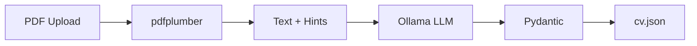

# CV Analyser

Extract structured career data from **text-based PDF resumes** into [**FreeCV `cv.json` v1.2**](https://freecv.org/schema/cv/v1.json) using a local LLM via [Ollama](https://ollama.com).

No cloud API. No fine-tuning. Prompt engineering + schema validation.

---

## Features

- **PDF → JSON** — upload a resume, get machine-readable `cv.json`
- **[FreeCV schema](https://freecv.org/open)** — `basics`, `work`, `education`, `skills`, `certificates`, `languages`, and more
- **Local inference** — Ollama runs on your machine (GPU when VRAM allows)
- **FastAPI + Swagger** — interactive API docs at `/docs`
- **Regex hints** — email, phone, and social URLs pre-detected to improve extraction
- **Pydantic validation** — output is validated against typed models before returning

---

## How it works

```
PDF file
  → pdfplumber (text extraction)
  → regex hints (email, phone, LinkedIn, GitHub)
  → Ollama LLM (JSON mode, single-pass prompt)
  → Pydantic validation (FreeCV v1.2)
  → cv.json response
```



---

## Requirements

| Component | Version |
|-----------|---------|
| Python | 3.11+ |
| [Ollama](https://ollama.com/download) | Latest |
| NVIDIA GPU (optional) | Recommended for speed |

### PDF input

- **Text-based PDFs only** (Word, Google Docs, LaTeX exports)
- Scanned/image PDFs are **not** supported (no OCR)

### GPU notes

| VRAM | Recommended model | Notes |
|------|-------------------|-------|
| **4 GB** (e.g. GTX 1650) | `llama3.2:3b-gpu` | Fits fully on GPU |
| **6–8 GB** | `llama3.2:3b-gpu` or `mistral:7b` | 7B may use partial CPU |
| **8 GB+** | `qwen2.5:7b` | Better quality, slower on small GPUs |

> **Important:** In Ollama, `num_gpu=0` means **CPU only**. Use `-1` for maximum GPU offload.

---

## Quick start (Windows)

### 1. Clone the repository

```powershell
git clone https://github.com/SALEM-ISMAIL-02/cv_analyser.git
cd cv_analyser
```

### 2. Install Ollama

Download and install from [ollama.com](https://ollama.com/download), then pull the GPU-tuned model:

```powershell
.\scripts\setup_ollama_gpu.ps1
```

This script:
- Stops any running models
- Pulls `llama3.2:3b`
- Creates `llama3.2:3b-gpu` (all layers on GPU, 4K context)

Verify GPU usage:

```powershell
ollama run llama3.2:3b-gpu "hello"
ollama ps
```

`PROCESSOR` should show **GPU**, not `100% CPU`.

### 3. Start the API

```powershell
.\scripts\start.ps1
```

Open **http://127.0.0.1:8000/docs**

### 4. Extract a CV

1. Call **`GET /health`** — expect `"status": "ok"`
2. Call **`POST /extract`** — upload a PDF
3. Receive structured `cv.json`

---

## Quick start (Linux / macOS)

```bash
# Ollama
curl -fsSL https://ollama.com/install.sh | sh
ollama pull llama3.2:3b
ollama create llama3.2:3b-gpu -f Modelfile.gpu

# Python
python3 -m venv .venv
source .venv/bin/activate
pip install -r requirements.txt

export OLLAMA_MODEL=llama3.2:3b-gpu
export OLLAMA_NUM_GPU=-1
uvicorn app:app --reload --host 127.0.0.1 --port 8000
```

---

## API reference

### `GET /health`

Check Ollama connectivity and model availability.

```json
{
  "status": "ok",
  "ollama": "reachable",
  "configured_model": "llama3.2:3b-gpu",
  "num_gpu": -1,
  "num_ctx": 4096,
  "gpu_mode": "max_vram",
  "available_models": ["llama3.2:3b-gpu", "llama3.2:3b"]
}
```

| `status` | Meaning |
|----------|---------|
| `ok` | Ready to extract |
| `model_missing` | Run `setup_ollama_gpu.ps1` |
| `error` | Ollama not running |

---

### `POST /extract`

Upload a PDF resume (`multipart/form-data`, field: `file`).

**Example (curl):**

```bash
curl -X POST "http://127.0.0.1:8000/extract" \
  -H "accept: application/json" \
  -F "file=@resume.pdf"
```

**Example response (truncated):**

```json
{
  "$schema": "https://freecv.org/schema/cv/v1.json",
  "basics": {
    "name": "Jane Doe",
    "label": "Software Engineer",
    "email": "jane@example.com",
    "phone": "+1 555 0100",
    "location": "Paris, France",
    "summary": "Backend developer with 3 years of experience."
  },
  "work": [
    {
      "company": "Acme Corp",
      "position": "Backend Developer",
      "startDate": "2022-01",
      "endDate": "2024-06",
      "highlights": ["Built REST APIs with FastAPI"]
    }
  ],
  "education": [],
  "skills": ["Python", "FastAPI", "PostgreSQL"],
  "languages": [],
  "certificates": [],
  "meta": {
    "version": "1.2",
    "canonical": "https://cv-analyser.local/extracted",
    "lastModified": "2026-06-06",
    "generator": "cv_analyser"
  }
}
```

---

## Configuration

Set via environment variables:

| Variable | Default | Description |
|----------|---------|-------------|
| `OLLAMA_MODEL` | `llama3.2:3b-gpu` | Ollama model name |
| `OLLAMA_NUM_GPU` | `-1` | GPU layers (`-1` = max VRAM, `0` = CPU only) |
| `OLLAMA_NUM_CTX` | `4096` | Context window size |
| `OLLAMA_API_URL` | `http://localhost:11434/api/chat` | Ollama API endpoint |

**Example — use a larger model (slower on 4 GB VRAM):**

```powershell
$env:OLLAMA_MODEL = "qwen2.5:7b-gpu"
$env:OLLAMA_NUM_GPU = "-1"
python -m uvicorn app:app --reload
```

---

## Project structure

```
cv_analyser/
├── app.py                    # FastAPI application
├── requirements.txt
├── Modelfile.gpu             # Ollama GPU model definition
├── schemas/
│   └── cv_schema.py          # FreeCV v1.2 Pydantic models
├── models/
│   └── llm_extractor.py      # Ollama client + prompts
├── utils/
│   ├── file_extractor.py     # PDF text extraction
│   └── text_hints.py         # Email / phone / URL hints
└── scripts/
    ├── setup_ollama_gpu.ps1  # Pull model + create GPU variant
    └── start.ps1             # Create venv + run API
```

---

## Troubleshooting

### `500` / `503` on `/extract`

1. Check **`GET /health`** first
2. If `model_missing` → run `.\scripts\setup_ollama_gpu.ps1`
3. If `ollama unreachable` → start Ollama (system tray or `ollama serve`)

### `100% CPU` in `ollama ps`

Your model is too large for VRAM. On **4 GB GPUs**, use `llama3.2:3b-gpu`, not `qwen2.5:7b`.

```powershell
ollama stop qwen2.5:7b-gpu
.\scripts\setup_ollama_gpu.ps1
```

### `ollama stop` error: accepts 1 arg

Stop a specific model by name:

```powershell
ollama ps
ollama stop qwen2.5:7b-gpu
```

### `No Python at C:\pypypypy\python.exe`

Old broken venv. Use the project `.venv`:

```powershell
.\scripts\start.ps1
```

Or manually:

```powershell
python -m venv .venv
.\.venv\Scripts\Activate.ps1
pip install -r requirements.txt
```

### Extraction is very slow

- Confirm GPU: `ollama ps` → should not say `100% CPU`
- Never set `OLLAMA_NUM_GPU=0`
- Use `llama3.2:3b-gpu` on 4 GB cards

### Empty or bad JSON fields

- Ensure the PDF has **selectable text** (try copy-paste in a PDF viewer)
- Complex multi-column layouts may garble text — simpler CV templates work best

---

## Tech stack

- **[FastAPI](https://fastapi.tiangolo.com/)** — REST API
- **[Ollama](https://ollama.com/)** — local LLM inference
- **[pdfplumber](https://github.com/jsvine/pdfplumber)** — PDF text extraction
- **[Pydantic](https://docs.pydantic.dev/)** — schema validation
- **[FreeCV cv.json](https://freecv.org/open)** — output standard

---

## Roadmap

- [ ] Section-by-section extraction for higher accuracy on long CVs
- [ ] OCR support for scanned PDFs
- [ ] JSON Schema export file in repo
- [ ] Docker Compose setup

---

## License

MIT — see [LICENSE](LICENSE) if present, or add your preferred license before publishing.

---

## Author

**Ismail Salem** — [GitHub](https://github.com/SALEM-ISMAIL-02)
